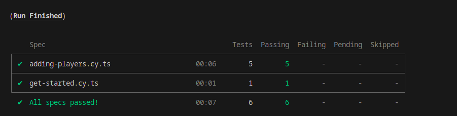
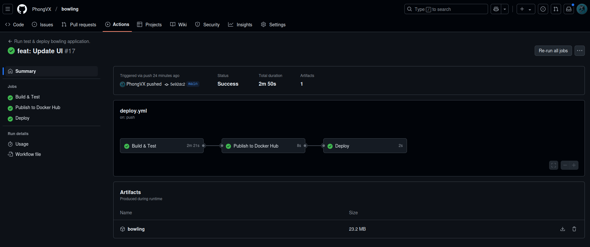

# How to run & test

## Install dependencies
Run the command ```npm install``` in the bowling folder to install the dependencies

## Start app in local
Run the command```npm run start``` to start the application, it will listen at port `3000`. Access
the application via this link: ```http://localhost:3000```

## Run the automation test in local
Run the command ```test:cypress:local``` to run the automation test on the link ```http://localhost:3000```

The record video can access in `./docs` folder



## Run the automation test in production
Run the command ```test:cypress:prod``` to run the automation test with the deployed link `https://bowling-application-phongvx-6b2bde09.koyeb.app`

# CI/CD pipeline
Build & Test: build docker image and run the automation test on pipeline.
Publish to Docker Hub: publish the docker image to the docker registry.
Deploy: deploy the application to ```koyeb.app``` using the latest version of the docker image.




